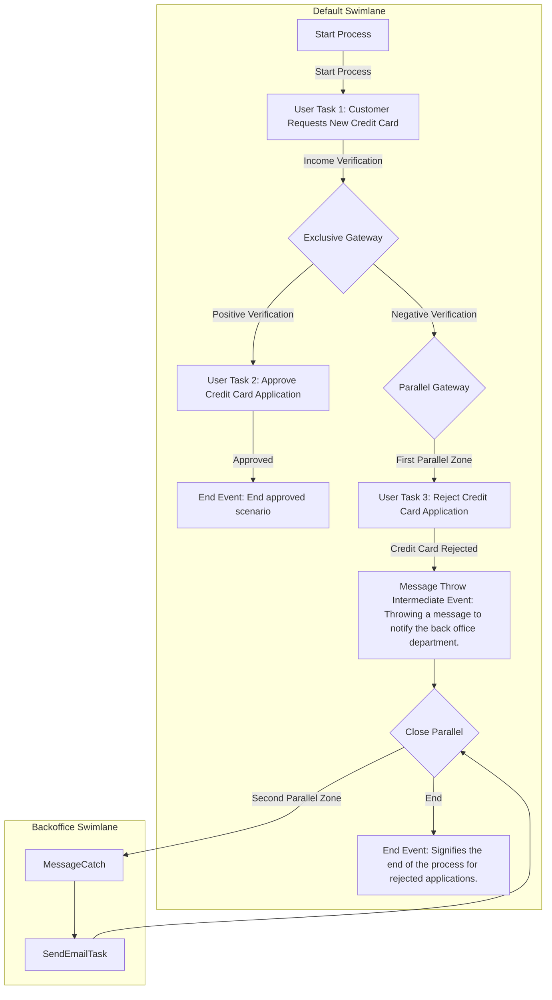
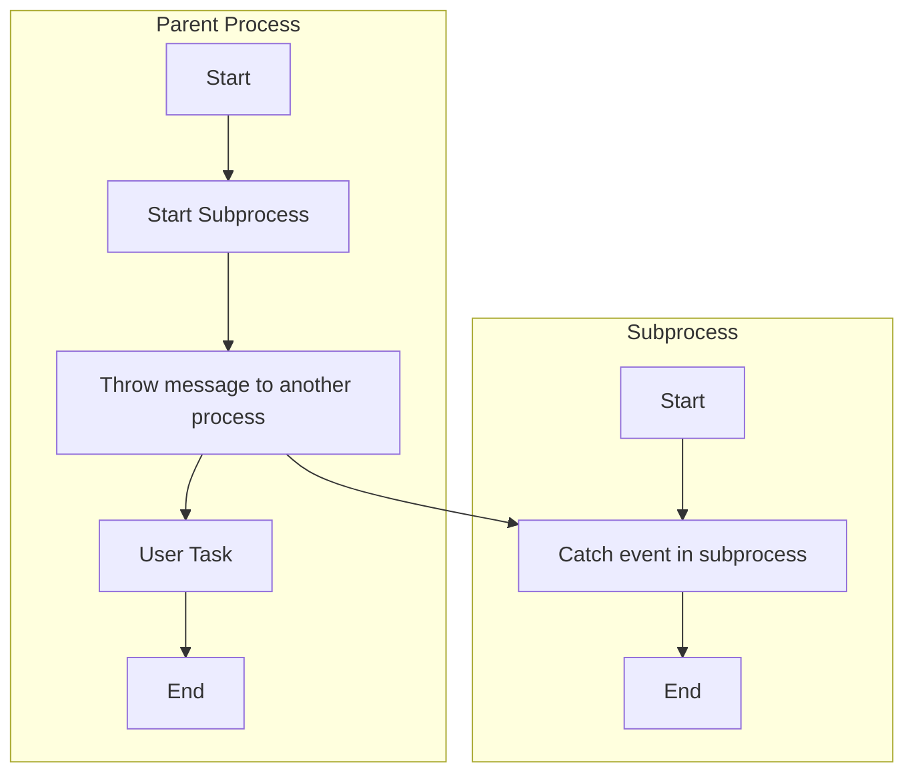

* [Throw and catch on sequence - credit card request process example](#throw-and-catch-on-sequence---credit-card-request-process-example)
* [Throw and catch - interprocess communication](#interprocess-communication-with-throw-and-catch-events)


## Throw and catch on sequence - Credit card request process example

### Business scenario

In the following example, we'll explore a credit card request process that encompasses the initiation of a customer's request, verification based on income rules, approval or rejection pathways, and communication between the client and back office. 


#### Activities

##### Default swimlane (client)

- **Start Event:** Marks the commencement of the process.
- **User Task 1:** Customer Requests New Credit Card - Involves the customer submitting a request for a new credit card.
- **Exclusive Gateway:** The process diverges based on the verification result (dependent on income rules).
  - **Path A (Positive Verification):**
    - **User Task 2:** Approve Credit Card Application - The bank approves the credit card application.
    - **End Event:** Denotes the conclusion of the process for approved applications.
  - **Path B (Negative Verification):**
    - **Parallel Gateway Open:** Creates two parallel zones.
    - **First Parallel Zone:**
      - **User Task 3:** Reject Credit Card Application - The bank rejects the credit card application.
      - **Message Throw Intermediate Event:** Signals the rejection, throwing a message to notify the back office department.
      - **End Event:** Signifies the end of the process for rejected applications.
    - **Second Parallel Zone:**
      - **User Task 3:** Reject Credit Card Application - The bank rejects the credit card application.
      - **Message Catch Intermediate Event:** The back office department is notified about the rejection.
      - **Send Message Task**: A notification is sent via email to the user about the rejection.
      - **End Event:** Signifies the end of the process for rejected applications.


##### Backoffice swimlane

- **Message Catch Intermediate Event:** The back office department awaits a message to proceed with credit card issuance.
- **Send Message Task:** Send Rejection Letter - Involves sending a rejection letter to the customer.


### Sequence flow




### Message flows

A message flow connects the Message Throw Intermediate Event to the Message Catch Intermediate Event, symbolizing the communication of credit card approval from the credit card approval task to the back office department.

In summary, when a customer initiates a new credit card request, the bank verifies the information. If declined, a message is thrown to notify the back office department. The Message Catch Intermediate Event in the back office awaits this message to proceed with issuing and sending the rejection letter to the customer.

### Configuring the BPMN process

To implement the illustrated BPMN process for the credit card request, follow these configuration steps:

<Steps>
<Step>
 **FLOWX.AI Designer**: Open FLOWX.AI Designer.
</Step>
<Step>
**Draw BPMN Diagram**: Import the provided BPMN diagram into FLOWX.AI Designer or recreate it by drawing the necessary elements. 
</Step>
<Step>
**Customize Swimlanes**: Set up the "Default" and "Backoffice" swimlanes to represent different departments or stakeholders involved in the process. This helps visually organize and assign tasks to specific areas.
</Step>
<Step>
**Define User Tasks**: Specify the details for each user task. Configure User Task 1, User Task 2, and User Task 3 with appropriate screens. 

* **User Task 1** - *customer_request_new_credit_card*

<Tip>
We will use the value from `application.income` key added on the slider UI element to create an MVEL business rule in the next step.
</Tip>


* **User Task 2** - *approve_credit_card_request*


In this screen, we configured a modal to display the approval.

* **User Task 3** - *reject_credit_card_request*


</Step>
<Step>
**Configure Gateways**: Adjust the conditions for the Exclusive Gateway based on your business rules. Define the conditions for positive and negative verifications, guiding the process down the appropriate paths. 

<Tip>
In our example, we used an MVEL rule to determine eligibility based on the income of the user. We used the `application.income` key configured in the first user task to create the rule.
</Tip>


Also, add Parallel gateways to open/close parallel paths.


</Step>
<Step>
**Set Message Events**: Configure the Message Throw and Message Catch Intermediate Events in the "Default" and "Backoffice" swimlanes, respectively. Ensure that the Message Catch Intermediate Event in the "Backoffice" swimlane is set up to wait for the specific message thrown by the Message Throw event. This facilitates communication between different stages of the process.
</Step>
<Step>
 **Define End Events**: Customize the End Events for approved and rejected applications in the "Default" swimlane. Also, set an end event in the "Backoffice" swimlane to indicate the completion of the back-office tasks. 
</Step>
<Step>
**Configure Send Message Task**: Set up the Send Message Task in the "Backoffice" swimlane to send a rejection letter as a notification to the user. 


Define the content of the rejection letter, the method of notification, and any additional details required for a seamless user experience. More details on how to configure a notification can be found in the following section:

<Card>
[**Sending a notification**](../../../../platform-deep-dive/plugins/custom-plugins/notifications-plugin/sending-a-notification)
</Card>
</Step>
<Step>
**Validate and Test**: Validate the BPMN diagram for correctness and completeness. Test the process flow by simulating different scenarios, such as positive and negative verifications.
</Step>
</Steps>

### Configuring intermediate message events

Configuring message events is a crucial step in orchestrating effective communication and synchronization within a business process. Whether you are initiating a message throw or awaiting a specific message with a catch, the configuration process ensures information exchange between different components of the process. 

In this section, we explore the essential steps and parameters involved in setting up message events to optimize your BPMN processes. 

### Message throw intermediate event

A Message Throw Intermediate Event is an event in a process where a message is sent to trigger communication or action with another part of the process (can be correlated with a catch event). It represents the act of throwing a message to initiate a specific task or notification. The event creates a connection between the sending and receiving components, allowing information or instructions to be transmitted. Once the message is thrown, the process continues its flow while expecting a response or further actions from the receiving component.

<Frame>


</Frame>


#### General Configuration

* **Can go back?** - Setting this to true allows users to return to this step after completing it. When encountering a step with `canGoBack` false, all steps found before it will become unavailable.

* **Correlate with catch message events** - The dropdown contains all catch messages from the process definitions accessible to the user, in our example: `throwcatchsequenceloan`

<Info>
It is imperative to define the message for the catch event first. This ensures its availability in the dropdown menu when configuring the throw intermediate event. 
</Info>

* **Correlation key** - This is a process key that uniquely identifies the instance to which the message is sent. In our example, we utilized the `processInstanceId` as the identifier, dynamically generated at runtime. This key is crucial for establishing a clear and distinct connection between the sender and recipient in the messaging process.


<Info>
A correlation key is a key that can have the same value across multiple instances, and it is used to match instances based on their shared value. It is not important what the attribute's name is (even though we map based on this attribute), but rather the value itself when performing the matching between instances.
</Info>

* **The Send data field** - This feature empowers you to define a JSON structure containing the data to be transmitted alongside the message. In our illustrative example, we utilized dynamic data originating from user input, specifically bound to a slider UI element.

```json
{"value": "${application.income}"}
```

* **Stage** - Assign a stage to the node.

In the end, this is what we have:

<Frame>


</Frame>

### Message catch intermediate event

A Message Catch Intermediate Event is a type of event in a process that waits for a specific message before continuing with the process flow. It enables the process to synchronize and control the flow based on the arrival of specific messages, ensuring proper coordination between process instances.

<Frame>


</Frame>

#### General Configuration

* **Can go back?** - Setting this to true allows users to return to this step after completing it. When encountering a step with `canGoBack` false, all steps found before it will become unavailable.
* **Correlate with throwing events** - The dropdown contains all catch messages from the process definitions accessible to the user (must be the same as the one assigned in Message throw intermediate event)
* **Correlation key** - Process key used to establish a correlation between the received message and a specific process instance (must be the same as the one assigned in Message throw intermediate event).
* **Receive data** - The process key that will be used to store the data received from the throw event along with the message.
* **Stage** - Assign a stage to the node.

<Frame>


</Frame>

### Testing the final result

After configuring the BPMN process and setting up all the nodes, it is crucial to thoroughly test the process to ensure its accuracy and effectiveness. 

<Info>
We will test the path where the user gets rejected.
</Info>


In the end, the user will receive this notification via email:

<Frame>


</Frame>

## Interprocess communication with throw and catch events

Facilitate communication between different processes by using message intermediate events. 

### Business scenario

Consider a Bank Loan Approval process where the parent process initiates a loan application. During the execution, it throws a message to a subprocess responsible for additional verification.

#### Activities

**Parent Process:**

- **Start Event:** A customer initiates a loan application.
- **Start Subprocess:** Initiates a subprocess for additional verification.
- **User Task:** Basic verification steps are performed in the parent process.
- **Throw Message:** After the basic verification, a message is thrown to indicate that the loan application is ready for detailed verification.
- **End Event:** The parent process concludes.

**Subprocess:**

- **Start Event:** The subprocess is triggered by the message thrown from the parent process.
- **Catch Message:** The subprocess catches the message, indicating that the loan application is ready for detailed verification.
- *(Perform Detailed Verification and Analysis)*
- **End Event:** The subprocess concludes.

### Sequence flow




### Message flows

- The parent subprocess triggers the subprocess run node, initiating the child process.
- Within the child process, a message catch event waits for and processes the message thrown by the parent subprocess.

### Configuring the parent process (throw event)


<Steps>
<Step>
Open **FLOWX.AI Designer** and create a new process.
</Step>
<Step>
Add a User Task for user input:

- Within the designer interface, add a "User Task" element to collect user input. Configure the user task to capture the necessary information that will be sent along with the message.


</Step>
<Step>
Integrate a [**Call activity**](../../../node/call-subprocess-tasks/call-activity-node.mdx) node:

- Add a "Subprocess Run Node" and configure it:

  * **Start Async** - Enable this option. When subprocesses are initiated in sync mode, they notify the parent process upon completion. The parent process then manages the reception of process data from the child and resumes its flow accordingly


- Add and configure the "Start Subprocess" action:

  * **Parameters**:
    * **Subprocess name** - Specify the name of the process containing the catch message event.
    * **Branch** - Choose the desired branch from the dropdown menu.
    * **Version** - Indicate the type of version to be utilized within the subprocess.


For a more comprehensive guide on configuring the "Start Subprocess" action, refer to the following section:

[Start Subprocess action](../../../../building-blocks/actions/start-subprocess-action)

</Step>
<Step>

Insert a Throw Event for Message Initiation:

- Add a "Throw Event" to the canvas, indicating the initiation of a message.
- Configure the throw message intermediate event node:

  * **Correlate with catch message events** - The dropdown contains all catch messages from the process definitions accessible to the user, in our example: `throwcatchDocs`

  * **Correlation key** - This is a process key that uniquely identifies the instance to which the message is sent. In our example, we utilized the `processInstanceId` as the identifier, dynamically generated at runtime. This key is crucial for establishing a clear and distinct connection between the sender and recipient in the messaging process.
  * **The Send data field** - This feature empowers you to define a JSON structure containing the data to be transmitted alongside the message. In our illustrative example, we utilized dynamic data originating from user input, specifically bound to some slider UI elements.

```json
{
  "client_details": {
    "clientIncome": ${application.income},
    "loanAmount": ${application.loan.amount},
    "loanTerm": ${application.loan.term}
  }
}
```
</Step>
</Steps>


### Configuring the subprocess (catch event)


<Steps>
<Step>

Insert an Intermediate Message Catch event and configure it:

* **Correlate with throwing events** - Utilize the same correlation settings added for the associated throw message event.
* **Correlation Key** - Set the correlation key to the parent process instance ID, identified as `parentProcessInstanceId`.
* **Receive data** - Specify the process key that will store the data received from the throw event along with the corresponding message.

<Frame>

</Frame>

</Step>
<Step>

Integrate and Fine-Tune a Service Task for Additional Verification.

* Incorporate a service task to execute the additional verification process. Tailor the configuration to align with your preferred method of conducting supplementary checks.
</Step>
</Steps>

### Throw with multiple catch events

<Card title = "Throw with multiple catch events example" href="https://s3.eu-west-1.amazonaws.com/docx.flowx.ai/release40/Throw%20with%20multiple%20catch%20events.pdf" icon ="download">
Download the example
</Card>