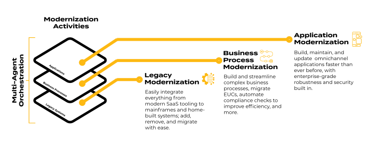
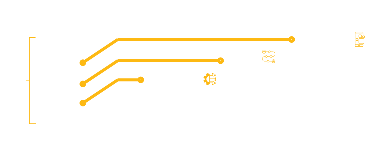
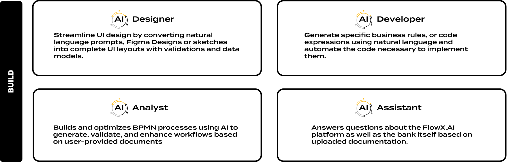
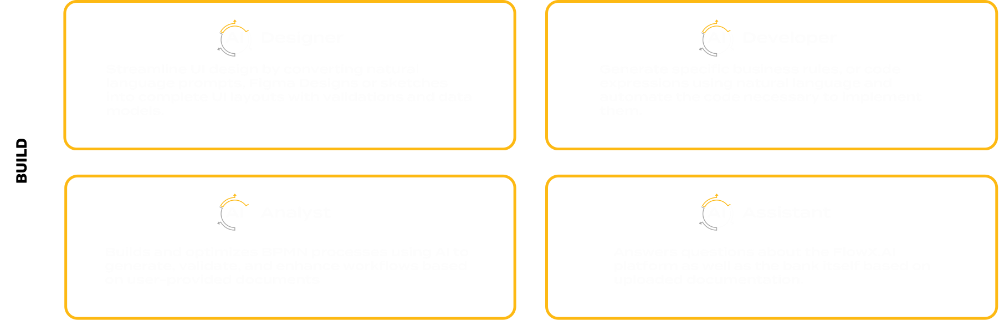

FlowX agents can tackle everything from targeted modernization projects to **total bank transformation.**

**AI Agents** are built in all layers of FlowX Platform covering the entire timeline for creating, consuming and maintaining an application:

## FlowX.AI Agents

### BUILD Agents

In the BUILD layer we have agents that automate and streamline the creation of data architectures, process models, integrations, user interfaces, and business rules by generating and validating content based on natural language prompts, existing documents, and best practices.

<CardGroup cols={2}>
  <Card title="Analyst" icon="robot" href="../platform-deep-dive/ai-core/ai-analyst">
    Builds and optimizes BPMN processes using AI to generate, validate, and enhance workflows based on user-provided documents
  </Card>
  <Card title="Assistant" icon="robot" href="../platform-deep-dive/ai-core/ai-assistant">
    Answers questions about the FlowX.AI platform as well as the bank itself based on uploaded documentation.
  </Card>
  <Card title="Designer" icon="robot" href="../platform-deep-dive/ai-core/ai-designer">
    Streamline UI design by converting natural language prompts, Figma Designs or sketches into complete UI layouts with validations and data models.
  </Card>
  <Card title="Developer" icon="robot" href="../platform-deep-dive/ai-core/ai-developer">
    Generate specific business rules, or code expressions using natural language and automate the code necessary to implement them.
  </Card>
</CardGroup>

See them in action:

<video
  controls
  className="w-full aspect-video"
  src="https://s3.eu-west-1.amazonaws.com/docx.flowx.ai/470/AI_Build_Agents.mp4"
></video>

### RUN Agents

The agents in the RUN layer monitor, debug, and optimize running processes, providing real-time supervision, automated testing, and on-demand reporting to ensure efficient operation.

<Card title="Coming soon">
Contact us for a demo.
</Card>

### OPTIMIZE Agents

The agents in the OPTIMIZE layer enhance business processes by testing, predicting outcomes, and suggesting improvements to increase efficiency and drive better results.

<Card title="Coming soon">
Contact us for a demo.
</Card>
