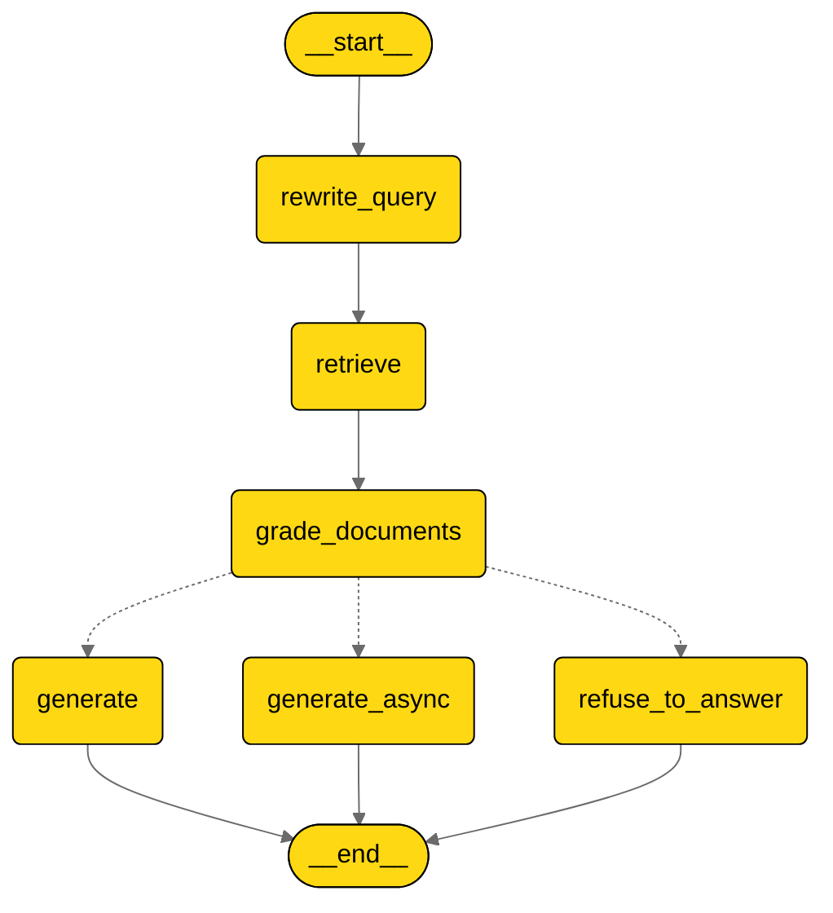

## Description

The AI Assistant provides intelligent documentation support for both the FlowX.AI platform and banking operations. By leveraging comprehensive documentation repositories, this agent delivers:

* **Accurate Responses:** Utilizes up-to-date product documentation for precise answers.
* **Consistency:** Ensures uniformity in responses across all user interactions.
* **Efficiency:** Reduces response time, enhancing user satisfaction.
* **Scalability:** Handles multiple user queries simultaneously without human intervention.
* **Streamlined Onboarding:** Provides instant, accurate answers to new users' questions, facilitating a smoother and faster onboarding process.

The assistant functions as a knowledge hub that can quickly search, retrieve, and synthesize information from both built-in FlowX.AI documentation and custom uploaded documents.

## Capabilities

The AI Assistant offers specialized content search functionality across different documentation sources:

### 1. Search into FlowX Documentation

* **Purpose:** Provides answers to questions about the FlowX.AI platform, its features, configuration options, and best practices.
* **Documentation Coverage:** Accesses a comprehensive repository of approximately 1,000 documentation chunks (318,000 tokens).
* **Query Types:** Handles direct questions, keyword searches, or general topic inquiries related to the platform.
* **Performance:** Documentation ingestion takes approximately 12 seconds, with rapid response times for most queries.
* **Response Format:** Delivers answers in well-formatted markdown for readability.

### 2. Search into Uploaded Documents

* **Purpose:** Extends knowledge base with custom documentation specific to your organization or banking operations.
* **Document Support:** Processes and indexes uploaded documentation to make it searchable.
* **Integration:** Seamlessly combines custom knowledge with platform documentation when answering queries.
* **Context Awareness:** Uses conversation history to better understand the intent behind questions.
* **Document Grading:** Evaluates the relevance of retrieved documents before generating responses.

## User Experience

The AI Assistant is easily accessible within the FlowX.AI Platform:

1. **Access Point:** Users can find the AI Assistant in the help section of the platform interface.

2. **Conversation Interface:** The assistant uses a chat-based interface where users can:
   - Type natural language questions
   - View responses in real-time with markdown formatting
   - Follow up with additional questions in a conversational manner

3. **Document Upload:** Users can upload custom documentation through:
   - The document upload interface in the assistant section
   - Selecting files from their local system
   - Providing URLs to documentation resources

4. **Saved Conversations:** Users can reference past interactions, with the assistant maintaining context between sessions.

## Anatomy

The AI Assistant architecture follows a sophisticated retrieval-augmented generation approach:

The workflow begins with query refinement, followed by document retrieval and relevance grading. Based on the quality of retrieved information, the system can generate an immediate response, process a more complex response asynchronously, or refuse to answer if no relevant documentation is found.

## Top rules for Designer AI Agent prompting

### ✅ DO the following

<Card icon="square-check" color="green" horizontal="true">
    **Be specific with your questions:**
    Clearly articulate what information you need about the FlowX.AI platform or banking operations. The more specific your question, the more precise the answer will be.
</Card>

<Card icon="square-check" color="green" horizontal="true">
    **Reference platform components:**
    Mention specific features, modules, or functions you're asking about to help the assistant retrieve the most relevant documentation.
</Card>

<Card icon="square-check" color="green" horizontal="true">
    **Provide context:**
    When asking follow-up questions, include relevant context or reference your previous inquiry to help the assistant understand the conversation flow.
</Card>

<Card icon="square-check" color="green" horizontal="true">
    **Ask about best practices:**
    The assistant can provide guidance on recommended approaches and implementation strategies based on official documentation.
</Card>

### ⛔ **DON’T** do these

<Card icon="ban" color="red" horizontal="true">
    **Don't ask about undocumented features:**
    The assistant relies on available documentation and may not be able to provide information about unreleased or undocumented functionality.
</Card>

<Card icon="ban" color="red" horizontal="true">
    **Don't expect troubleshooting of specific implementations:**
    While the assistant can provide general guidance, it cannot debug custom code or analyze specific implementation issues without detailed context.
</Card>

<Card icon="ban" color="red" horizontal="true">
    **Don't assume complete knowledge:**
    If documentation doesn't cover a particular topic, the assistant may not be able to provide comprehensive information on that subject.
</Card>

<Card icon="ban" color="red" horizontal="true">
    **Don't ask unrelated questions:**
    The assistant is specialized in FlowX.AI platform and banking documentation and may not provide accurate answers on unrelated topics.
</Card>
