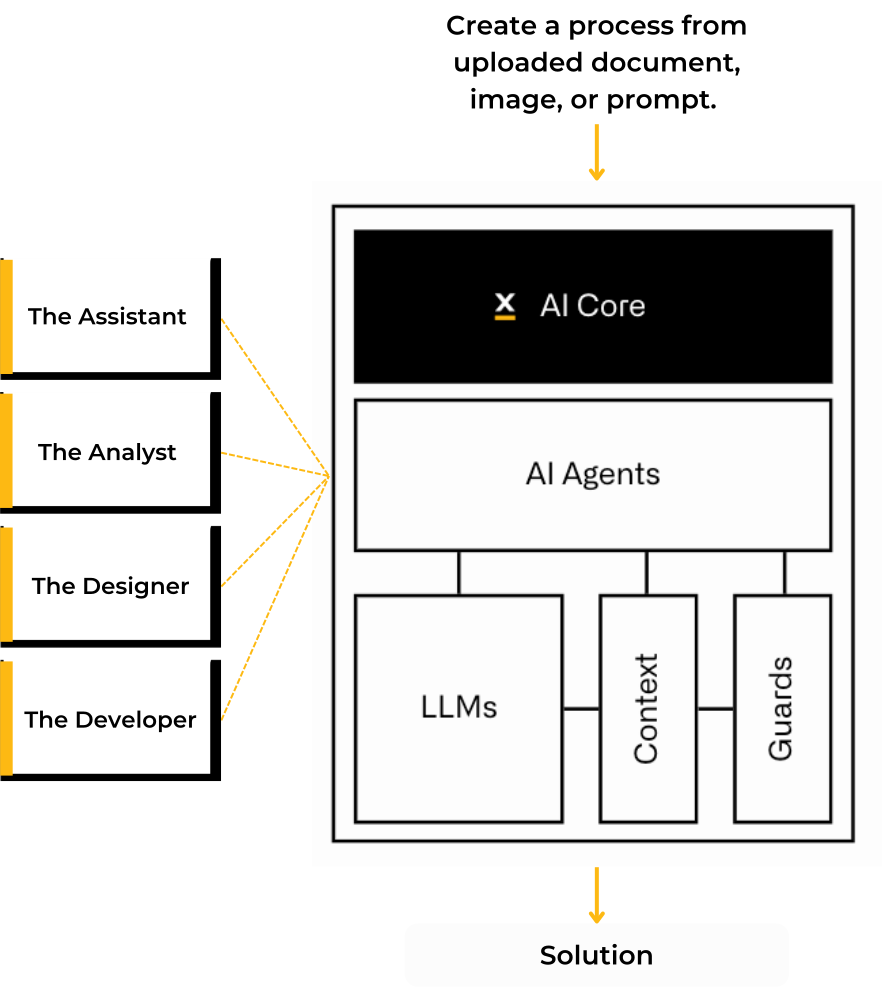
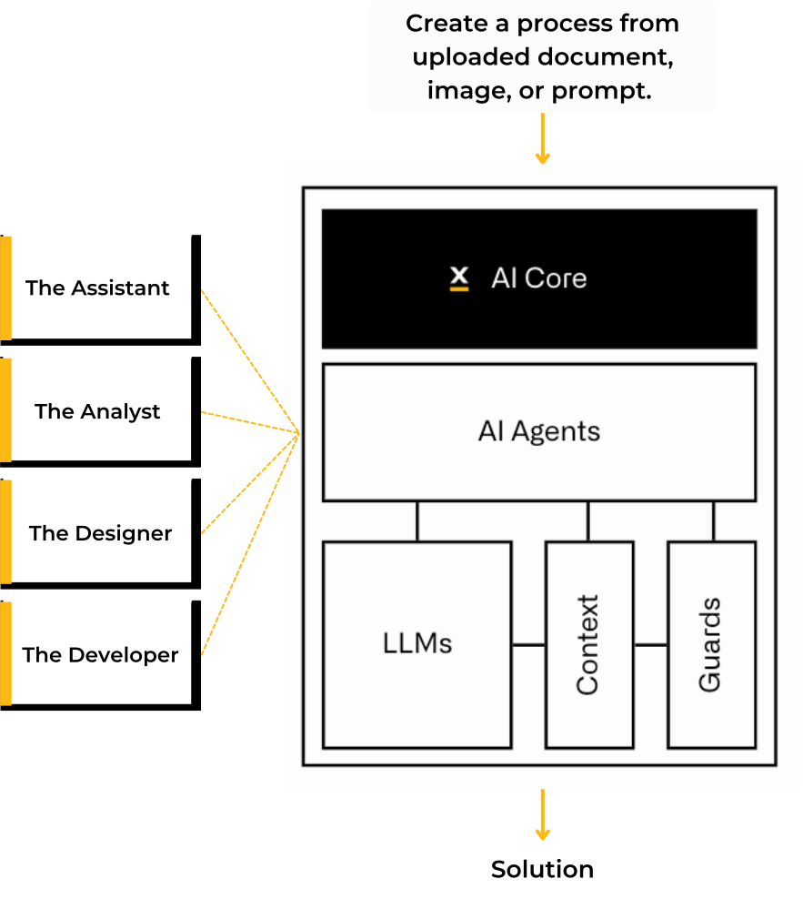

AI in FlowX is built on a system of interconnected language models that's refreshingly LLM-agnostic (because who wants to be locked into a single model these days?). It uses an agent-based architecture where specialized AI workers tackle various tasks, all while staying connected to the data flowing through the FlowX Platform.

**Being LLM Agnostic, FlowX AI-Core offers deployment flexibility that would make a yoga instructor jealous:**

1. **The Full Package**: Use our embedded open-source LLMs that come with FlowX Platform. These models run in a Kubernetes Cluster and talk seamlessly with the FlowX Platform.
2. **The DIY Option**: Run your own custom LLM models through what we like to call our "model registry mechanism." Bring your own models, we'll handle the wiring.
3. **The Integration Play**: Deploy FlowX without our LLM models and connect to your internal LLMs that support the OpenAI API format. Just point our agents to your endpoint via `ENV_VARS` and you're good to go.
4. **The Cloud Route**: Connect to public LLM providers like OpenAI, Google, Microsoft, Anthropic, IBM, or whatever new AI company popped up while you were reading this doc.

Access to the LLM can be done through a proxy or gateway as soon as access is granted to the AI agents to access and create an inference. 

Using AI-Core in FlowX it can help enterprises save time, improve quality, and enhance creativity. By providing users with suggestions that are relevant and diverse, FlowX can help users generate content much faster. 

Agents in FlowX were built based on specific use-cases to read, understand and process FlowX data by offering assisted-development similar to GitHub Copilot.

---
## Access AI in FlowX

In FlowX, one shortcut rules them all: Cmd/CTRL+K. Wherever you are in our platform, you can bring up the command palette by using the same keyboard shortcut.

<Info>
Cmd/CTRL+K summons the FlowX Command Palette, your shortcut to getting things done fast.

A **command palette is a user interface** (UI) element that's basically a search bar with superpowers—giving you quick access to commands without clicking through endless menus. It narrows down options as you type, almost like it's reading your mind (but less creepy).
</Info>

Not a keyboard shortcut fan? Just look for the "✨" icon, which marks the spots where AI features are hiding throughout the interface.

<Frame>

</Frame>

FlowX Command creates a central command headquarters where all platform actions live together in harmony. It simplifies the mental model of the platform from "where was that feature again?" to "let me just ask for it." Command palettes let users zip through tasks like they've been using the platform for years, even if they started yesterday—which explains why they're enjoying a renaissance in modern UIs.