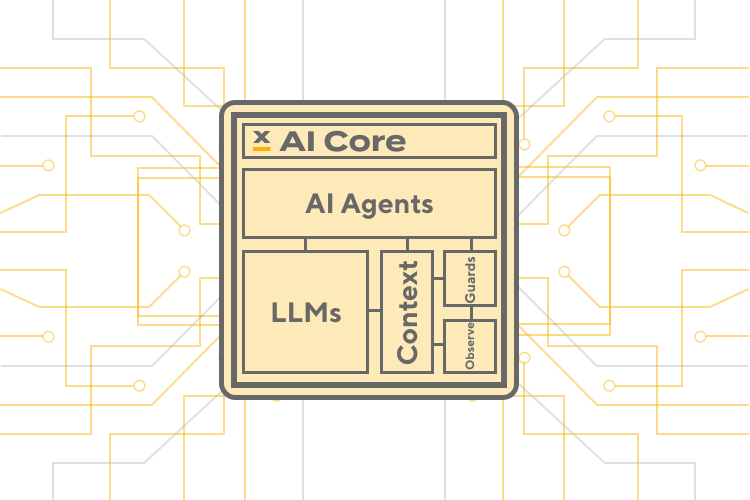
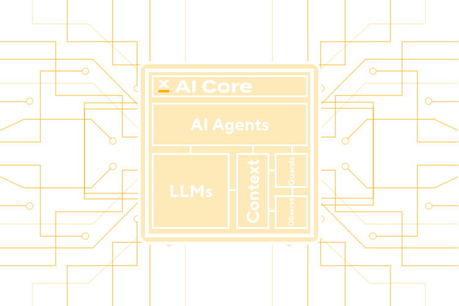

## Introduction

AI in FlowX it’s built on a system of interconnected multiple language models and it’s LLM agnostic. It leverages an architecture based on agents and tools that can solve various tasks that are related or connected with data provided by FlowX Platform. 

**Being LLM Agnostic, FlowX AI-Core can work in the following deployment options:**

1. Use the embedded open-source LLMs models provided with FlowX Platform. The Deployment is made in a Kubernetes Cluster and is interconnected with FlowX Platform.
2. It can also run custom LLM models. This is our option for “model registry mechanism”.
3. FlowX can be deployed without FlowX LLM Models, and can use client owned private internal LLMs that provide the OpenAI API format. This will be provided as an endpoint via `ENV_VARS` to agents for owned internal LLM.
4. Use any public LLMs Providers like OpenAI, Google, Microsoft, Anthropic, IBM, etc.

Access to the LLM can be done through a proxy or gateway as soon as access is granted to the AI agents to access and create an inference. 

Using AI-Core in FlowX it can help enterprises save time, improve quality, and enhance creativity. By providing users with suggestions that are relevant and diverse, FlowX can help users generate content much faster. 

Agents in FlowX were built based on specific use-cases to read, understand and process FlowX data by offering assisted-development similar to GitHub Copilot.
