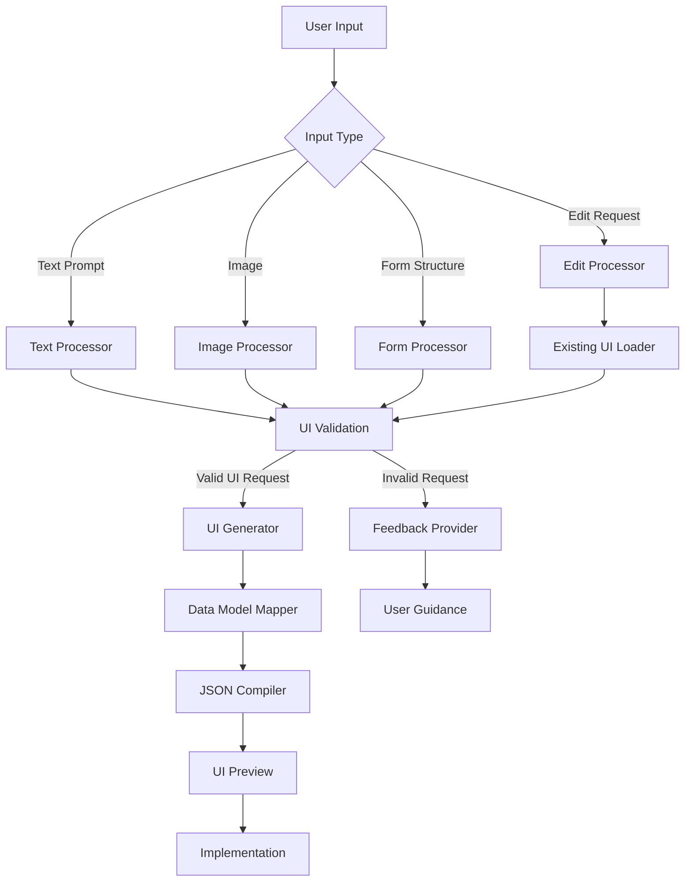

## Description

The AI Designer is a powerful tool that transforms design concepts into functional UI components for the FlowX.AI platform. Whether you start with a text description, an image of a design, or a form structure, the AI Designer can generate complete, interactive UI layouts that are immediately usable in your applications. It also handles mapping UI elements to your data model and can modify existing designs based on natural language instructions, significantly accelerating the UI development process.

## Capabilities

The AI Designer offers two main categories of capabilities:

### Generate New UI

1. **Generate UI from Text**
   - Creates complete UI layouts based on natural language descriptions
   - Interprets design requirements and converts them into structured UI elements
   - Maps generated UI components to data model entities when available
   - Produces JSON representations that are automatically parsed into FlowX.AI components
   - Validates that prompts are UI-related before proceeding with generation

2. **Generate UI from Image**
   - Extracts UI designs from uploaded images (sketches, mockups, screenshots)
   - Works with hand-drawn sketches, Figma designs, or other visual UI representations
   - Processes complex images by splitting them into sections for parallel analysis
   - Reconstructs the visual design as functional FlowX.AI UI components
   - Supports additional textual context to guide the interpretation

3. **Generate UI from Form**
   - Creates structured form interfaces based on form descriptions or requirements
   - Automatically adds appropriate validations for form fields
   - Organizes form elements in a logical, user-friendly layout
   - Connects form fields to the corresponding data model properties

### Edit Existing UI

1. **Edit UI from Text**
   - Modifies specific containers or cards in existing UI designs
   - Updates layouts, components, or properties based on natural language instructions
   - Preserves the structure and functionality of unmodified UI elements
   - Maintains data model connections while implementing requested changes
   - Validates that edit requests are UI-related before applying modifications

## User Experience

The AI Designer is accessed through the FlowX.AI Platform interface. Users can:

1. Access the AI Designer from the platform's design tools section
2. Select the desired capability (Generate or Edit)
3. Provide input in the appropriate format:
   - Text description for generating or editing UI
   - Image upload for visual-based UI generation
   - Form structure for form-specific UI creation
4. Optionally link to an existing data model to enable automatic field mapping
5. Preview the generated UI components in real-time
6. Make adjustments through the "Edit" capability if necessary
7. Implement the final UI components in their application

The agent performs validation checks to ensure inputs are appropriate for UI generation, providing helpful feedback when adjustments are needed.

## Anatomy

The AI Designer integrates visual recognition and natural language processing to transform various inputs into structured UI representations.

The workflow begins with user input being categorized and processed based on its type. All inputs undergo validation to ensure they describe UI elements. For valid requests, the UI Generator creates the appropriate components, which are then mapped to the data model if available. The final output is compiled into a JSON representation that the FlowX.AI platform can interpret and display as a functional UI.

## Top rules for Designer AI Agent prompting

### ✅ DO the following

<Card icon="square-check" color="green" horizontal="true">
    **Specify a type of screen:**
    This means specifying a signup screen, a profile page or anything else that you want to add to your design. Use a context
</Card>

<Card icon="square-check" color="green" horizontal="true">
    **Add extra context:** 
    If designing a user bank app UI, and you want a screen solely about my expenses, include this in your prompt. For example, ‘`A expenses page that tracks a list of expenses that includes merchant value and transaction date`’. This ensures a tailored screen generation focused on expense-related content.
</Card>

<Card icon="square-check" color="green" horizontal="true">
    **Describe user interactions:**
    Explain how users should interact with the UI, including any specific workflows, validation requirements, or dynamic behaviors the UI should support.
</Card>

<Card icon="square-check" color="green" horizontal="true">
    **Have fun and be creative:** 
    Most importantly, unleash creativity in your prompts. See what you can generate that will make your UI design stand out from the rest. The screen designer agent has a multitude of capabilities, so make sure to try them out.
</Card>

### ⛔ **DON’T** do these

<Card icon="ban" color="red" horizontal="true">
    **Don’t specify colors:**
    The single-screen generator cannot create a new design screen in a different color. However, it is easy to switch up the colors of your generated screen using theming feature.
</Card>

<Card icon="ban" color="red" horizontal="true">
    **Don’t describe multiple screens**
    The screen generator can only generate one type of screen at once. So if you use a prompt referring to two different screens, only one type will be generated.
</Card>

<Card icon="ban" color="red" horizontal="true">
    **Don’t mention a different device:** 
    Our AI agents don’t understand designing in different design screens. So if you want a different device design screen, check in UI designer how your generated design looks on different platforms (Mobile / Web).
</Card>

<Card icon="ban" color="red" horizontal="true">
    **Don't expect platform-specific knowledge:**
    The AI Designer has no knowledge about other nodes or information in your project beyond what you provide in your prompt or the associated data model.
</Card>
