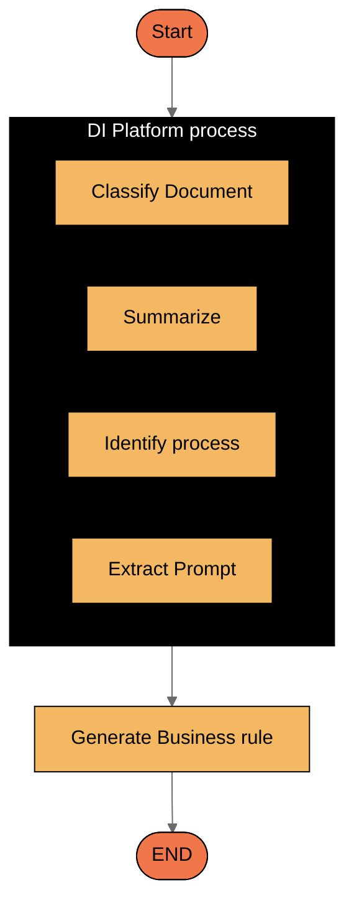

## Description

The AI Developer is an intelligent agent that transforms natural language descriptions into functional code. It helps developers generate business rules, JavaScript expressions, and test data without requiring manual coding. The agent can also edit existing code, provide explanations, and translate between programming languages, significantly accelerating the development process.

<Frame>
<video
  controls
  className="w-full aspect-video"
  src="https://s3.eu-west-1.amazonaws.com/docx.flowx.ai/470/ai-developer.mp4"
  autoPlay
  muted
  loop
></video>
</Frame>

## Capabilities

The AI Developer offers two main categories of capabilities:

### Generate New Code

1. **Generate Business Rule**
   - Transforms natural language descriptions into code using the data model as context
   - Supports JavaScript, Python, and MVEL
   - Produces clean, functional business rule code based on text prompts

2. **Generate Business Rule from Document**
   - Extracts business rule definitions from uploaded documents
   - Identifies relevant text on each page that describes business rules
   - Summarizes and presents the information to users in a dropdown
   - Generates corresponding code based on the selected rule description

3. **Generate (un)Hide JavaScript Expression**
   - Creates JavaScript expressions for conditional visibility of elements
   - Uses the data model as context for proper variable references

4. **Generate Computed JavaScript Expression**
   - Produces JavaScript code for calculated or derived values
   - Leverages the data model to ensure proper variable referencing

### Edit Existing Code

1. **Edit Existing Business Rule**
   - Modifies existing code based on natural language instructions
   - Uses the data model as context for accurate updates

2. **Fix / Explain Code**
   - Fixes errors in business rules based on error logs
   - Provides clear explanations of what the code does

3. **Translate Code Between Programming Languages**
   - Converts business rules from one language to another
   - Maintains functionality while adapting to language-specific syntax

## User Experience

The AI Developer is accessible through the FlowX.AI Platform interface. Users can:

1. Select the desired capability from the AI Developer section
2. Provide natural language instructions or upload relevant documents
3. Specify programming language preferences when applicable
4. Review and implement the generated code

For document-based generation, users can upload documents, view extracted rule descriptions in a dropdown, select the rule they want to generate, and receive the corresponding code.

## Anatomy

The AI Developer architecture integrates large language models with the FlowX.AI Platform to seamlessly convert natural language to code.

## Top rules for Designer AI Agent prompting

### ✅ DO the following

<Card icon="square-check" color="green" horizontal="true">
    **Be specific with your requirements:**
    Clearly state what the business rule should accomplish, including conditions, actions, and expected outcomes.
</Card>

<Card icon="square-check" color="green" horizontal="true">
    **Reference data model elements:**
    Mention specific data fields or entities that the code should interact with to ensure proper context.
</Card>

<Card icon="square-check" color="green" horizontal="true">
    **Specify the programming language:**
    Always indicate whether you need JavaScript, Python, or another supported language for your code generation.
</Card>

<Card icon="square-check" color="green" horizontal="true">
    **Provide edge cases:**
    Mention special conditions or exceptions that the business rule should handle to ensure robust code.
</Card>

### ⛔ **DON’T** do these

<Card icon="ban" color="red" horizontal="true">
    **Don't be vague:**
    Avoid ambiguous descriptions that can lead to incorrect implementation. Be precise about the logic you need.
</Card>

<Card icon="ban" color="red" horizontal="true">
    **Don't reference external systems:**
    The AI Developer has no knowledge of external systems not defined in the provided context.
</Card>

<Card icon="ban" color="red" horizontal="true">
    **Don't skip defining variables:**
    Make sure to define all variables or data fields that your business rule will use.
</Card>

<Card icon="ban" color="red" horizontal="true">
    **Don't expect platform-specific knowledge:**
    The agent doesn't know about keys or information not defined in the data model or provided context.
</Card>
