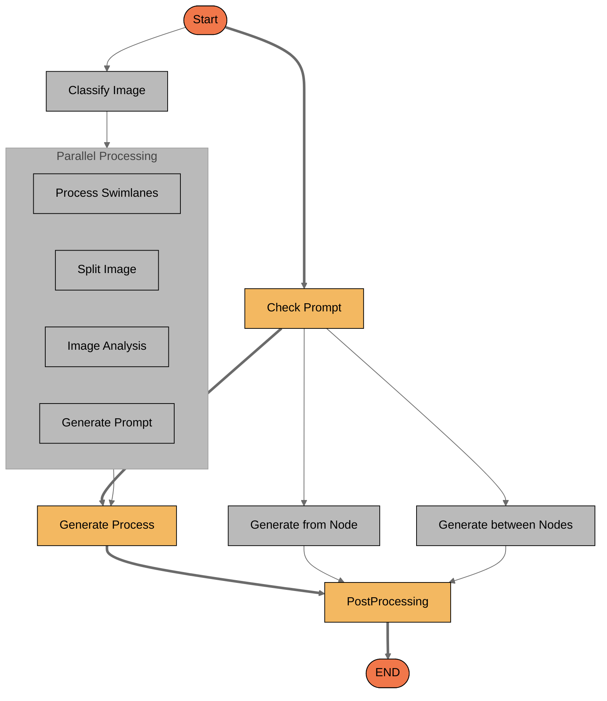
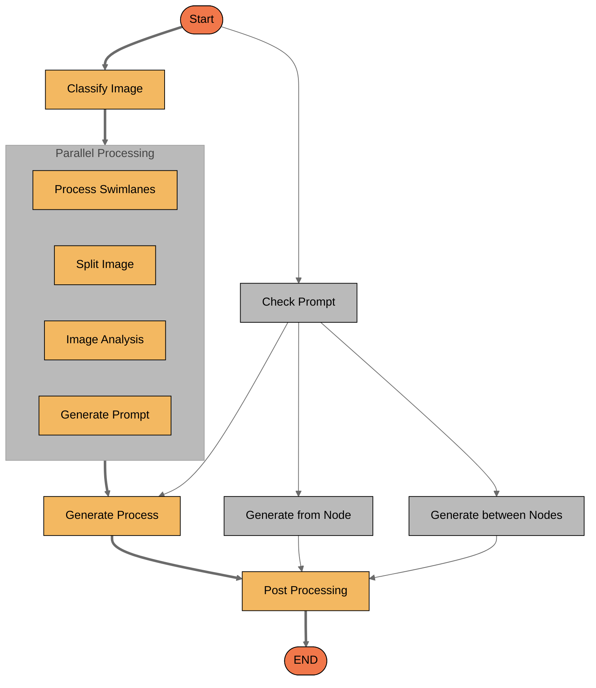

## Description

The AI Analyst is an intelligent agent that transforms various inputs into Business Process Model and Notation (BPMN) processes. It can generate complete workflows from text prompts, images, or documents, as well as modify existing BPMN processes. The agent uses advanced AI to interpret requirements and convert them into structured JSON representations that the FlowX.AI platform can interpret and visualize as proper BPMN diagrams.

<Frame>
<video
  controls
  className="w-full aspect-video"
  src="https://s3.eu-west-1.amazonaws.com/docx.flowx.ai/470/ai-analyst.mp4"
  autoPlay
  muted
  loop
></video>
</Frame>

## Capabilities

The AI Analyst offers two main categories of capabilities:

### Generate New Processes

1. **Generate from Prompt**
   - Creates a complete BPMN process based on natural language descriptions
   - Transforms textual requirements into a structured workflow
   - Produces a JSON representation containing nodes (with name and type) and links between nodes

2. **Generate from Image**
   - Extracts BPMN process information from uploaded images
   - Identifies swimlanes and components in diagram images
   - Can process various image resolutions (from small < 4K to large > 8K)
   - Accepts optional text descriptions for additional context
   - Combines visual recognition with language processing for accurate interpretation

3. **Generate from Document**
   - Extracts process descriptions from uploaded documents
   - Analyzes textual content to identify workflow components and relationships
   - Creates a structured representation of the described process

### Edit Existing Processes

1. **Generate Process from BPMN File**
   - Imports and interprets existing BPMN files
   - Converts external BPMN formats into FlowX.AI-compatible representations

2. **Generate In-between Nodes**
   - Adds missing steps between existing nodes in a workflow
   - Enhances process completeness and logical flow

3. **Generate from Node**
   - Expands a process by adding subsequent steps after a specified node
   - Allows incremental development of complex workflows

4. **Edit Existing Process**
   - Modifies components of an existing process based on user instruction
   - Updates node properties, connections, or process structure

## User Experience

The AI Analyst is accessed through the FlowX.AI Platform interface. Users can:

1. Select the desired capability from the AI Analyst section
2. Provide input in the appropriate format (text prompt, image, document, or BPMN file)
3. Add additional context or requirements if needed
4. Review the generated process in a visual BPMN format
5. Make adjustments through the "Edit" capabilities if necessary
6. Implement the final workflow in their project

The interaction follows a human-in-the-loop approach, allowing for quality checks and iterative improvements to ensure the generated process meets requirements.

## Anatomy

The AI Analyst architecture integrates multiple AI components to process different input types and generate standardized BPMN output.

The workflow begins with a user query that gets rewritten for clarity. A quality check determines if more information is needed, in which case a human provides additional context. Once sufficient information is available, the process generation component creates the BPMN workflow, which is then delivered to the user.

## Top rules for Designer AI Agent prompting

### ✅ DO the following

<Card icon="square-check" color="green" horizontal="true">
    **Be specific about process goals:**
    Clearly state what the process should accomplish, including start and end points, major milestones, and desired outcomes.
</Card>

<Card icon="square-check" color="green" horizontal="true">
    **Describe key participants and roles:**
    Mention the different stakeholders or departments involved in the process and their responsibilities.
</Card>

<Card icon="square-check" color="green" horizontal="true">
    **Include decision points:**
    Specify any conditional logic or decision points that might create branches in the workflow.
</Card>

<Card icon="square-check" color="green" horizontal="true">
    **Provide process constraints:**
    Mention any business rules, regulations, or time constraints that should be incorporated into the process design.
</Card>

### ⛔ **DON’T** do these

<Card icon="ban" color="red" horizontal="true">
    **Don't be too technical with BPMN terms:**
    You don't need to use precise BPMN terminology; the AI Analyst can interpret business language and convert it to appropriate BPMN elements.
</Card>

<Card icon="ban" color="red" horizontal="true">
    **Don't request subprocess details:**
    The AI Analyst has no knowledge about subprocesses or other platform-specific information not provided in your input.
</Card>

<Card icon="ban" color="red" horizontal="true">
    **Don't upload low-quality images:**
    When generating from images, ensure the diagram is clear and readable to improve accuracy of the generated process.
</Card>

<Card icon="ban" color="red" horizontal="true">
    **Don't expect platform-specific optimizations:**
    The AI Analyst generates standard BPMN representations and may not incorporate FlowX.AI platform-specific features automatically.
</Card>
