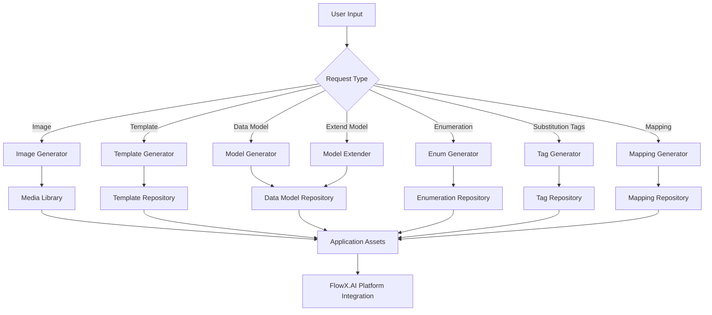

## Description

The AI Architect helps create and manage the foundational elements of your FlowX.AI applications. It streamlines the development of data models, enumerations, templates, and other essential components by analyzing requirements and generating appropriate structures. This agent can create new assets or extend existing ones, ensuring that your application has a solid backbone of well-structured data and resources.

## Capabilities

The AI Architect offers two main categories of capabilities:

### Generate New Assets

1. **Generate Image**
   - Creates custom images based on textual descriptions
   - Produces visual assets that can be used in your application
   - Quality and relevance depend on the specificity of the input prompt
   - Images are automatically added to your media library

2. **Generate Notification/Document Template**
   - Creates email, SMS, or document templates from text descriptions
   - Can extract content from PDF documents to generate document templates
   - Includes appropriate subject lines and body content
   - Integrates placeholders from data model for personalized communications
   - Templates can be used for user notifications or document generation

3. **Generate Data Model**
   - Creates structured data models based on textual requirements
   - Defines entities, attributes, relationships, and data types
   - Can analyze and extend existing data models
   - Serves as the foundation for application data structure
   - Ensures consistency across your application components

4. **Generate Enumeration**
   - Creates sets of named constants (enumerations) from descriptions
   - Defines valid options for categorical data fields
   - Can update existing enumerations with new options
   - Helps standardize input validation and data consistency

5. **Generate Substitution Tags**
   - Creates tags that can be used to insert dynamic content
   - Maps UI elements to corresponding data model properties
   - Enables personalized content in templates and interfaces
   - Facilitates dynamic data display in UI components

6. **Generate Mapping**
   - Creates relationships between different data entities
   - Maps UI elements to data model properties
   - Establishes connections between different components of your application
   - Ensures proper data flow throughout the system

### Edit Existing Assets

- **Extend Data Model**
   - Adds new entities, attributes, or relationships to existing data models
   - Modifies data types or constraints based on evolving requirements
   - Preserves existing model structure while extending functionality
   - Ensures backward compatibility with existing application components

## User Experience

The AI Architect is accessed through the FlowX.AI Platform interface. Users can:

1. Navigate to the AI Architect section in the platform
2. Select the desired capability from the available options
3. Provide natural language descriptions of their requirements
4. Upload relevant documents (PDFs) when necessary for template generation
5. Review the generated assets before implementation
6. Make adjustments through the "Edit" capabilities if necessary
7. Implement the finalized assets in their application

The agent processes requests quickly and generates assets that conform to FlowX.AI platform standards, significantly accelerating the development of application fundamentals.

## Anatomy

The AI Architect integrates with various components of the FlowX.AI platform to provide comprehensive asset generation capabilities.

The workflow begins with user input being directed to the appropriate generator based on the request type. Each generator creates specialized assets that are stored in their respective repositories. These assets are then made available as application components that integrate with the FlowX.AI platform.

## Top rules for Designer AI Agent prompting

### ✅ DO the following

<Card icon="square-check" color="green" horizontal="true">
    **Be specific about data structure requirements:**
    Clearly describe the entities, attributes, and relationships you need in your data model or the specific values for enumerations.
</Card>

<Card icon="square-check" color="green" horizontal="true">
    **Provide context about the application domain:**
    Include information about your application's purpose and the business domain to help the AI generate more relevant assets.
</Card>

<Card icon="square-check" color="green" horizontal="true">
    **Describe data validation needs:**
    Mention any specific validation rules, constraints, or data formats that should be incorporated into the model.
</Card>

<Card icon="square-check" color="green" horizontal="true">
    **Give examples for templates:**
    When requesting document or notification templates, provide examples of the type of content, tone, and structure you want.
</Card>

### ⛔ **DON’T** do these

<Card icon="ban" color="red" horizontal="true">
    **Don't be overly technical:**
    You don't need to use database-specific terminology; the AI Architect can interpret business requirements and convert them to appropriate technical implementations.
</Card>

<Card icon="ban" color="red" horizontal="true">
    **Don't assume platform knowledge:**
    The AI Architect has no knowledge about other nodes or information in your project outside of what you provide in your prompt.
</Card>

<Card icon="ban" color="red" horizontal="true">
    **Don't request complex integrations:**
    Focus on the data structure and assets rather than platform-specific integrations or complex business logic.
</Card>

<Card icon="ban" color="red" horizontal="true">
    **Don't expect implementation details:**
    The AI Architect generates structural components but doesn't handle implementation specifics like backend code or system configurations.
</Card>
