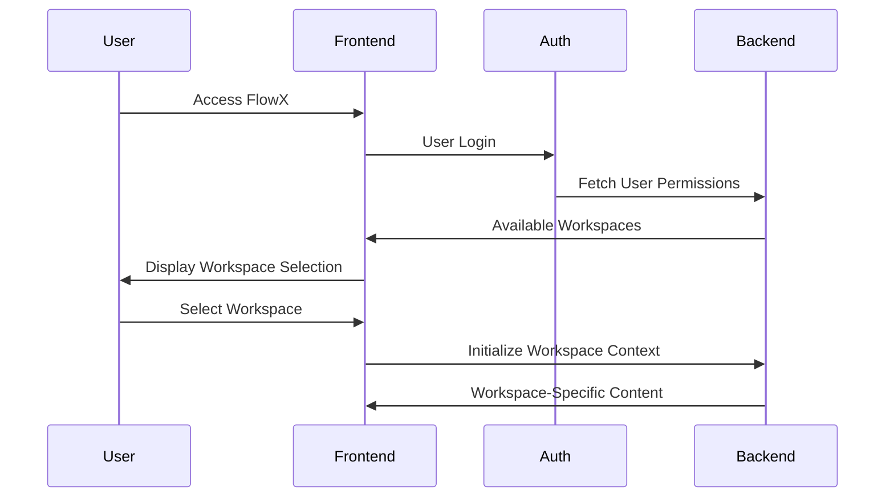

<Info>
**Available from FlowX.AI version 5.0**

Workspaces replace the previous single-tenant model, enabling organizations to manage multiple business contexts within one FlowX instance.
</Info>

## Overview

Workspaces provide multi-tenant capabilities that allow organizations to manage multiple business lines, verticals, or countries within a single FlowX instance. This feature enables logical data isolation while maintaining the flexibility to share resources when needed.

### Key benefits

<CardGroup cols={2}>
  <Card title="Cost Optimization" icon="dollar-sign">
    Maintain a single FlowX instance for multiple business units, reducing infrastructure costs and centralizing upgrades
  </Card>
  <Card title="Faster Onboarding" icon="rocket">
    Streamline the process of adding new business verticals to the platform
  </Card>
  <Card title="Data Isolation" icon="shield-check">
    Provide secure separation between different business contexts while allowing controlled resource sharing
  </Card>
  <Card title="Enhanced Access Control" icon="key">
    Implement granular permissions with role-based access control (RBAC) and access control lists (ACLs)
  </Card>
</CardGroup>

## Key concepts

### Workspace
A workspace is an isolated environment within FlowX.AI that contains its own set of projects, users, roles, and resources. Each workspace operates independently, ensuring data and configuration separation between different business contexts.

### Multi-workspace user access
Users can be granted access to multiple workspaces and can switch between them as needed. When a user has access to multiple workspaces, they can select which workspace to enter after authentication.

### Data isolation
Workspaces provide logical data isolation, meaning that resources (projects, libraries, themes, etc.) are scoped to specific workspaces and cannot be accessed from other workspaces without explicit sharing configurations.

## Workspace use cases

<AccordionGroup>
  <Accordion title="Multiple Business Lines" icon="building">
    **Isolation Level**: High
    
    Different use cases, projects, permissions, and users between business verticals (e.g., retail vs. corporate vs. investment banking).
    
    **Shared Resources**: 
    - Shared users across business lines
    - Shared library builds
    - Shared themes (configurable)
    
    <Note>Assumes no hierarchy between workspaces. Only project-level data model in scope for 5.0</Note>
  </Accordion>
  
  <Accordion title="Regional Separation" icon="globe">
    **Isolation Level**: Medium
    
    Same business line across different regions, subject to local regulations.
    
    **Shared Resources**:
    - Libraries
    - Some shared users
    
    <Warning>Lower priority scenario for initial implementation</Warning>
  </Accordion>
  
  <Accordion title="Distinct Organizations" icon="users">
    **Isolation Level**: Highest
    
    Complete separation for different customers or organizations.
    
    **Shared Resources**: None
    
    <Note>Primarily for community edition scenarios</Note>
  </Accordion>
</AccordionGroup>

## Architecture changes

### Database integration

<Steps>
  <Step title="SpiceDB Integration">
    New permission management system using SpiceDB for granular access control
  </Step>
  <Step title="Workspace-Scoped Resources">
    All resources (projects, libraries, themes) are marked with a unique workspace ID
  </Step>
  <Step title="User Storage Evolution">
    Users are now stored in the FlowX database upon first login instead of relying solely on external identity providers
  </Step>
</Steps>

### Role management evolution

<Tabs>
  <Tab title="Previous Model">
    - Token-based roles
    - Single-tenant permissions
    - External identity provider dependency
  </Tab>
  <Tab title="New Model">
    - Database-stored roles per workspace
    - Workspace-specific permissions
    - No cross-workspace role transfer
  </Tab>
</Tabs>

### Authentication flow

The frontend initialization process now involves multiple sequential calls:



## Access control

### Role-based access control (RBAC)

<CardGroup cols={2}>
  <Card title="Predefined Roles" icon="user-tag">
    - `admin` - Full workspace administration
    - `configurator` - Project and process configuration
    - `ui_ux_designer` - Interface design capabilities
    - `project_viewer` - Read-only project access
  </Card>
  <Card title="Custom Roles" icon="user-plus">
    Create workspace-specific roles with tailored permissions for your organization's needs
  </Card>
</CardGroup>

### Access control lists (ACLs)

<AccordionGroup>
  <Accordion title="Resource-Specific Permissions" icon="file-shield">
    Grant fine-grained control over individual resources within a workspace, allowing exceptions to general role permissions.
  </Accordion>
  
  <Accordion title="Exception-Based Access" icon="user-check">
    Provide specific users or groups access to individual resources without requiring full platform permissions.
    
    **Example**: A user can be given edit access to a single project without full configurator permissions.
  </Accordion>
  
  <Accordion title="Owner Management" icon="crown">
    Resource creators can manage access to their specific resources without requiring full admin intervention.
  </Accordion>
</AccordionGroup>

### User groups

<Info>
User groups simplify permission management by allowing you to assign permissions to groups rather than individual users.
</Info>

- **Default Groups**: Each workspace includes an "Everyone in workspace" default group
- **Custom Groups**: Create groups based on teams, departments, or project requirements
- **Inherited Permissions**: Users automatically inherit permissions from their group memberships

## Workspace management

### Creating a workspace

<Steps>
  <Step title="Admin Access">
    Ensure you have workspace administrator permissions
  </Step>
  <Step title="Workspace Configuration">
    Set workspace name, description, and basic settings
    
    <CodeGroup>
    ```json Workspace Configuration
    {
      "name": "retail-banking",
      "displayName": "Retail Banking Division",
      "description": "Workspace for retail banking processes and applications",
      "region": "US",
      "settings": {
        "allowCrossWorkspaceSharing": false,
        "defaultUserRole": "project_viewer"
      }
    }
    ```
    </CodeGroup>
  </Step>
  <Step title="Initial Setup">
    System automatically creates default roles and groups for the new workspace
  </Step>
  <Step title="User Assignment">
    Add initial users and assign appropriate roles
  </Step>
</Steps>

### Workspace administration

<Tabs>
  <Tab title="Settings Management">
    - Configure workspace-specific parameters
    - Set policies and restrictions
    - Manage integration configurations
  </Tab>
  <Tab title="User Management">
    - Add and remove workspace users
    - Assign and modify user roles
    - Manage group memberships
  </Tab>
  <Tab title="Access Matrix">
    Visual interface for auditing and adjusting permissions across users, roles, and entities
  </Tab>
</Tabs>

### Resource management

<Warning>
**Important Limitations**
- Projects cannot be exported from one workspace to another on the same environment
- Cross-workspace resource access requires explicit sharing configuration
</Warning>

<AccordionGroup>
  <Accordion title="Project Isolation" icon="folder-closed">
    Projects are completely isolated within their workspace and cannot be directly accessed from other workspaces.
  </Accordion>
  
  <Accordion title="Library Build Sharing" icon="books">
    Library builds can be reused across workspaces on the same environment, enabling code reuse while maintaining project isolation.
  </Accordion>
  
  <Accordion title="Theme Sharing" icon="palette">
    Themes can be shared between workspaces when configured appropriately, allowing consistent branding across business units.
  </Accordion>
</AccordionGroup>

## Migration and compatibility

### Existing customer migration

<Steps>
  <Step title="Automatic Default Workspace">
    System creates a default workspace containing all existing:
    - Projects and process definitions
    - Libraries and dependencies
    - Themes and UI configurations
    - Custom integrations and configurations
  </Step>
  
  <Step title="User Migration">
    All existing users are automatically migrated to the default workspace with their current access levels
  </Step>
  
  <Step title="Role Recreation">
    <Warning>
    Previous Keycloak roles are **not** migrated. New database-stored roles must be created and assigned.
    </Warning>
  </Step>
  
  <Step title="Predefined Roles">
    System automatically creates standard predefined roles in the default workspace
  </Step>
</Steps>

### New Environment Setup

<Note>
New FlowX.AI 5.0 environments do **not** include a default workspace. Initial setup is required.
</Note>

<Steps>
  <Step title="First Admin User">
    Configure the initial workspace administrator user
  </Step>
  <Step title="Initial Workspace">
    Create the first workspace before platform use
  </Step>
  <Step title="User Onboarding">
    Set up initial users and role assignments
  </Step>
</Steps>

## Security considerations

### Data boundaries

<CardGroup cols={2}>
  <Card title="Logical Isolation" icon="shield-halved">
    Workspaces provide logical rather than hard data isolation using database-level separation
  </Card>
  <Card title="Resource Scoping" icon="tag">
    All resources are tagged with workspace IDs to prevent unauthorized cross-workspace access
  </Card>
</CardGroup>

### Permission validation

- **Endpoint Validation**: Backend validates permissions for all API endpoints
- **Resource Access Control**: Users can only access resources they have explicit permissions for
- **Audit Trail**: All access attempts and permission changes are logged for security monitoring

## Configuration

### Environment variables

<CodeGroup>
```bash Environment Configuration
# Workspace Feature Control
WORKSPACE_DEFAULT_ENABLED=true
WORKSPACE_CROSS_SHARING_ENABLED=false

# SpiceDB Configuration
SPICEDB_ENDPOINT=localhost:50051
SPICEDB_TOKEN=your_spicedb_token
SPICEDB_INSECURE=false

# Initial Admin Configuration
WORKSPACE_ADMIN_USER=admin@yourcompany.com
WORKSPACE_ADMIN_ROLE=workspace_admin
```
</CodeGroup>

### Database configuration

<Steps>
  <Step title="SpiceDB Setup">
    Configure SpiceDB instance for permission management
    
    ```bash
    # SpiceDB Docker Setup
    docker run --name spicedb \
      -p 50051:50051 \
      -d authzed/spicedb serve \
      --grpc-preshared-key "your_preshared_key"
    ```
  </Step>
  
  <Step title="Schema Migration">
    Run provided migration scripts for existing installations
    
    ```sql
    -- Example migration for workspace support
    ALTER TABLE projects ADD COLUMN workspace_id VARCHAR(255);
    ALTER TABLE libraries ADD COLUMN workspace_id VARCHAR(255);
    ALTER TABLE themes ADD COLUMN workspace_id VARCHAR(255);
    ```
  </Step>
</Steps>

## Best practices

<CardGroup cols={3}>
  <Card title="Workspace Design" icon="compass">
    - Define clear business boundaries
    - Use consistent naming conventions
    - Document workspace purposes and policies
  </Card>
  <Card title="Permission Management" icon="key">
    - Apply principle of least privilege
    - Use groups instead of individual assignments
    - Conduct regular permission audits
  </Card>
  <Card title="Resource Sharing" icon="share-nodes">
    - Implement clear sharing policies
    - Track resource dependencies
    - Maintain version control for shared resources
  </Card>
</CardGroup>

## API reference

### Workspace management

<CodeGroup>
```javascript List Workspaces
GET /api/workspaces
Authorization: Bearer {token}

// Response
{
  "workspaces": [
    {
      "id": "retail-banking",
      "name": "Retail Banking",
      "description": "Retail banking processes",
      "permissions": ["read", "edit"]
    }
  ]
}
```

```javascript Create Workspace
POST /api/workspaces
Authorization: Bearer {token}
Content-Type: application/json

{
  "name": "corporate-banking",
  "displayName": "Corporate Banking",
  "description": "Corporate banking division workspace",
  "settings": {
    "allowCrossWorkspaceSharing": false
  }
}
```

```javascript Update Workspace
PUT /api/workspaces/{workspaceId}
Authorization: Bearer {token}
Content-Type: application/json

{
  "displayName": "Updated Display Name",
  "description": "Updated description",
  "settings": {
    "allowCrossWorkspaceSharing": true
  }
}
```
</CodeGroup>

### User management

<CodeGroup>
```javascript List Workspace Users
GET /api/workspaces/{workspaceId}/users
Authorization: Bearer {token}

// Response
{
  "users": [
    {
      "id": "user123",
      "email": "john.doe@company.com",
      "roles": ["configurator"],
      "groups": ["Everyone in workspace", "Developers"]
    }
  ]
}
```

```javascript Add User to Workspace
POST /api/workspaces/{workspaceId}/users
Authorization: Bearer {token}
Content-Type: application/json

{
  "userId": "user123",
  "roles": ["project_viewer"],
  "groups": ["Everyone in workspace"]
}
```
</CodeGroup>

## Troubleshooting

<AccordionGroup>
  <Accordion title="Users Cannot Access Workspace" icon="user-slash">
    **Common Causes:**
    - User not added to workspace
    - Missing role assignments
    - Incorrect group memberships
    
    **Solutions:**
    1. Verify user exists in workspace user list
    2. Check role assignments in access matrix
    3. Validate group memberships
    4. Clear user sessions and re-authenticate
  </Accordion>
  
  <Accordion title="Resource Access Denied" icon="ban">
    **Common Causes:**
    - Insufficient role permissions
    - Missing ACL permissions
    - Wrong workspace context
    
    **Solutions:**
    1. Verify user role includes required permissions
    2. Check resource-specific ACL settings
    3. Confirm user is in correct workspace
    4. Review audit logs for access attempts
  </Accordion>
  
  <Accordion title="Permission Changes Not Taking Effect" icon="clock">
    **Common Causes:**
    - Cached permission data
    - SpiceDB synchronization delay
    - Active user sessions
    
    **Solutions:**
    1. Clear user sessions and re-authenticate
    2. Verify SpiceDB synchronization status
    3. Check for cached permission data
    4. Review permission change logs
  </Accordion>
</AccordionGroup>

<Card title="Need Help?" icon="life-ring">
For complex workspace configuration issues or permission problems, contact FlowX.AI support with:
- Workspace configuration details
- User permission requirements
- Relevant error logs
- Steps to reproduce the issue
</Card>