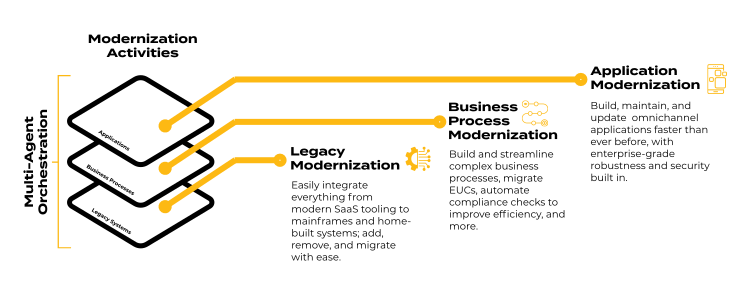
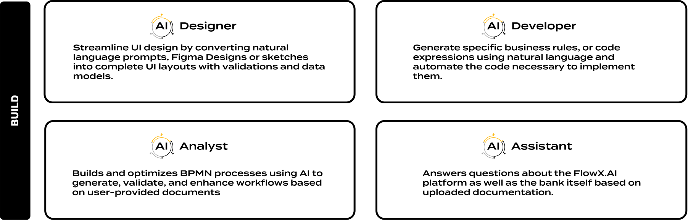
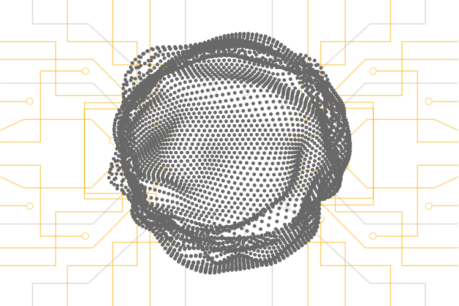

FlowX agents can tackle everything from targeted modernization projects to total bank transformation. Our platform deploys a network of specialized AI agents working in concert to modernize banking operations across the entire application lifecycle.

**AI Agents** are built in all layers of FlowX Platform covering the entire timeline for creating, consuming and maintaining an application:

AI Agents are strategically embedded in every layer of the FlowX Platform. They're like the Avengers of banking software—if Iron Man specialized in UI design and Captain America was really good at compliance.

### Why Multi-Agent Architecture Matters?

Our multi-agent approach makes traditional monolithic AI systems look like they're still using dial-up internet:

| Feature            | FlowX Multi-Agent Approach                                 | Traditional Banking AI                       |
| ------------------ | ---------------------------------------------------------- | -------------------------------------------- |
| **Specialization** | Purpose-built agents for specific banking functions        | Generic capabilities requiring customization |
| **Adaptability**   | Modular updates to individual agents as regulations change | Complete system overhauls (ouch)             |
| **Transparency**   | Clear visibility into agent decision processes             | Black box of mystery                         |
| **Resilience**     | System continues despite component failures                | One crash and everyone's having a bad day    |

## FlowX.AI Agents

Our platform organizes intelligent agents into four functional layers—because three would be insufficient and five would be showing off:

### BUILD Agents

In the BUILD layer we have agents that automate and streamline the creation of data architectures, process models, integrations, user interfaces, and business rules by generating and validating content based on natural language prompts, existing documents, and best practices.

<CardGroup cols={2}>
  <Card title="Analyst" icon="robot" href="../platform-deep-dive/ai-core/ai-analyst">
    Builds and optimizes BPMN processes using AI to generate, validate, and enhance workflows based on user-provided documents
  </Card>
  <Card title="Assistant" icon="robot" href="../platform-deep-dive/ai-core/ai-assistant">
    Answers questions about the FlowX.AI platform as well as the bank itself based on uploaded documentation.
  </Card>
  <Card title="Designer" icon="robot" href="../platform-deep-dive/ai-core/ai-designer">
    Streamline UI design by converting natural language prompts, Figma Designs or sketches into complete UI layouts with validations and data models.
  </Card>
  <Card title="Developer" icon="robot" href="../platform-deep-dive/ai-core/ai-developer">
    Generate specific business rules, or code expressions using natural language and automate the code necessary to implement them.
  </Card>
</CardGroup>

See them in action (no 3D glasses required):

<video
  controls
  className="w-full aspect-video"
  src="https://s3.eu-west-1.amazonaws.com/docx.flowx.ai/470/AI_Build_Agents.mp4"
></video>

### MAINTAIN Agents

The agents in the MAINTAIN layer ensure ongoing compliance and generate comprehensive documentation to keep processes aligned with regulations and up-to-date at every step.

<CardGroup cols={2}>
  <Card title="Auditor" icon="robot">
    **Coming soon**
     
    Ensures compliance across complex processes, business rules & massive datasets using regulatory documentation.
  </Card>
  <Card title="Writer" icon="robot">    
    **Coming soon**
     
    Generate comprehensive documentation step-by-step using predefined templates, starting from smaller blocks and building up to a complete technical document.
  </Card>
</CardGroup>

### RUN Agents

The agents in the RUN layer monitor, debug, and optimize running processes, providing real-time supervision, automated testing, and on-demand reporting to ensure efficient operation.

<CardGroup cols={2}>
  <Card title="Supervisor" icon="robot">
    **Coming soon**
     
    Supports maintenance & debugging of running processes and systems, and can generate reports & graphs on-demand.
  </Card>
  <Card title="Inspector" icon="robot">
    **Coming soon**
     
    Inspect process configuration during build to detect misconfigurations and suggest now the business process can be enhanced.
  </Card>
</CardGroup>

### OPTIMIZE Agents

The agents in the OPTIMIZE layer enhance business processes by testing, predicting outcomes, and suggesting improvements to increase efficiency and drive better results.

<CardGroup cols={2}>
  <Card title="Optimizer" icon="robot">
    **Coming soon**
     
    Run business processes with synthetic data to test outcomes, detect potential issues, and improve process efficiency based on execution time results.
  </Card>
  <Card title="Inspector" icon="robot">
    **Coming soon**
     
    Predicts business outcomes and optimizes processes by analyzing metrics, audit logs, and generating on-demand reports.
  </Card>
</CardGroup>

## Enterprise-Grade Security for Banking

FlowX AI Agents are built for the stringent security requirements of the banking sector:

- **Zero-Trust Security Model**: FlowX AI Agents utilize a dynamic Zero-Trust security approach, ensuring that all components within the system authenticate each other. This prevents unauthorized access and ensures that interactions within the platform remain secure.
- **Input and Output Scanners**: The platform employs a comprehensive set of input and output scanners, including those for detecting prompt injection, banning sensitive substrings, and sanitizing outputs. This minimizes the risk of harmful or unauthorized data being processed or exposed.
- **Custom Fine-Tuned Models**: FlowX develops custom fine-tuned models for each use case, tailored with curated data, which enhances the accuracy and security of AI agents, particularly in sensitive environments like banking.
- **Human Oversight and Monitoring**: The platform includes robust human-in-control mechanisms, enabling human oversight and control over AI agents to ensure ethical decision-making and secure interactions, crucial for high-stakes environments like banking.

## Advanced Hallucination Prevention

- **RAG**: We use Retrieval-Augmented Generation (RAG) to ground responses in reliable, external data sources.
- **Architecture**: We employ a multi-agent architecture where each task is assigned to dedicated agents, allowing for efficient task splitting and specialized processing.
- **JSON**: We enforce structured JSON outputs because letting an AI freestyle its responses would be like letting a toddler freestyle with finger paints in your living room.
- **LLM EVALUATION**: We relentlessly test models to find the perfect fit for each banking task. It's like speed dating, but for AI models, and the stakes are your bank's efficiency.
- **PROMPT Tuning**: Prompt tuning for each task customizes the model’s responses, enhancing accuracy and relevance while reducing the likelihood of hallucinations